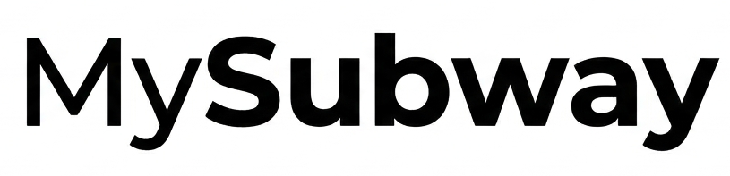

<div align="center">
  
</div>

# Transit Diagram

Turn hand-drawn transit diagrams into machine-readable data using AI vision extraction.

## Problem & Solution

Transit networks are complex to document, and manual data entry is tedious and error-prone. **Transit Diagram** solves this by combining an interactive drawing canvas with AI-powered extraction—upload a transit diagram sketch, and Google Gemini instantly extracts structured station and line data, then renders it as a clean schematic visualization.

## Key Features

- **AI-Powered Extraction**: Upload a transit diagram image; Gemini Vision API extracts lines, stations, and network structure
- **Interactive Canvas**: Draw or import transit networks on a zoomable, color-coded canvas
- **Instant Rendering**: Automatic schematic diagram generation via Graphviz
- **Full-Stack**: Modern React + Laravel pipeline, tested and production-ready

## How It Works

```
Upload Image
    ↓
Gemini Vision extracts geometric data (stations, lines, coordinates)
    ↓
Parse JSON with transit network schema
    ↓
Graphviz renders as schematic SVG
    ↓
Convert to PNG and display
```

The AI applies sophisticated geometric rules: grid-snapping, transfer point detection, and schematic alignment to produce clean, standardized diagrams from sketches.

## Example Data

See [canada_line5.json](app/Helpers/canada_line5.json) for the transit schema structure (lines, stations, coordinates).

## Project Structure

- **app/Helpers/**: Core processing pipeline (image extraction, AI prompting, Graphviz rendering)
- **resources/js/pages/Welcome.tsx**: Interactive React canvas UI with drawing tools
- **routes/api.php**: `/api/convert-image` endpoint for image processing
- **tests/**: PestPHP feature tests and CI/CD workflows

## Testing & CI/CD

Automated PestPHP tests validate the image conversion pipeline. GitHub Actions workflows run on all commits for PHP linting, formatting, and test coverage across PHP 8.4 and 8.5+.

## Tech Stack

**Frontend**: React 19, TypeScript, Konva canvas, Tailwind CSS, Vite  
**Backend**: Laravel 12, PHP 8.2+, Google Gemini Vision API  
**Rendering**: Graphviz, SVG-to-PNG conversion with librsvg

## Quick Start

### Prerequisites
- Node.js 22+
- PHP 8.2+
- Graphviz
- `rsvg-convert` (librsvg)

### Setup

```bash
git clone <repo>
cd TransitDiagram
composer run setup
```

This will install dependencies, configure `.env`, generate keys, and build assets.

### Development

```bash
composer run dev
```

Open `http://localhost:8000` and start drawing or uploading transit diagrams.

### Environment

Create or update `.env` with:
```
GEMINI_API_KEY=your_gemini_api_key
```

### Run Tests

```bash
composer run test
```
